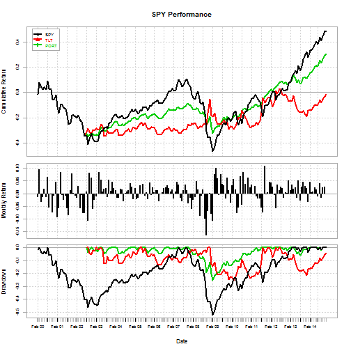

Dynamic Portfolio Rebalance Application
========================================================
author: Pat Warner
date: Dec 18 2014

What does this app do?
========================================================

* Dynamic Portfolio Rebalancing is a well known asset allocation
method used in Financial Portfolio Mangement.
* Rather than put all our risk into one asset, we
can divide or allocate our portfolio into n assets and
rebalance monthly. Our App allows 2 assets.
* Port Total Monthly Return is : 
$$PortRtn = \alpha*Rtn1 + (1-\alpha)*Rtn2$$
* $\alpha$ is the allocation amount we allocated to the first asset.
$1 - \alpha$ is the allocation amount to the second asset.
Notice the total portfolio allocation will always equal 100%
* Portolio rebalancing can lower total portfolio risk,
while maintaining reasonable returns.
* So, why is our application so important?


** Shiny Applicaton located at https://patwarner.shinyapps.io/DataProducts/

Dynamic Visualization
=========================================================

* We can now adjust a slider bar to allocate between 0 to 100% 
and automatically see our graphical and tabular Portfolio results
dynamically!
* We use the classical allocation strategy between a market 
equities index (ETF is SPY) and a bond index (ETF is TLT).
* We can manually adjust the allocation and intuitively see
results in real time.
* We can see drawdown curve can be reduced significantly by
adjusting our allocation level.

Graphical and tabular live updates 
========================================================

R code output displays comparison 
of results.


```
      SPY  TLT PORT
cagr 0.07 0.03 0.06
dd   0.52 0.25 0.25
```

***

We can see portfolio results improved optimized annual returns (cagr) and 
drawdown (dd) over individual asset results.

 
 
Peformance Summary Table tab
================================================================================

|     | 2006| 2007|  2008| 2009| 2010| 2011| 2012| 2013|
|:----|----:|----:|-----:|----:|----:|----:|----:|----:|
|Jan  |  0.7|  0.5|  -1.7| -6.3|  1.2|  2.4|  0.8|  1.1|
|Feb  | -1.8| -0.7|   0.2|  5.7|  1.6| -0.4| -0.8|  1.4|
|Mar  | -0.9|  2.5|   0.9|  1.4|  2.2|  2.4|  1.9|  3.2|
|Apr  | -1.8|  0.4|  -0.8|  0.9| -1.6|  0.9|  1.4| -2.3|
|May  |  0.3| -1.6|  -3.3| -0.1| -0.1| -2.4|  0.8| -2.7|
|Jun  |  1.1| -0.1|  -0.8|  3.9|  2.8|  1.0|  2.4|  1.3|
|Jul  |  2.4|  1.3|   2.0|  2.8|  1.8|  1.9|  0.5| -2.3|
|Aug  |  1.9|  1.6|  -4.4|  2.6|  2.8|  2.7| -0.4|  1.5|
|Sep  |  1.8|  1.4|  -9.3| -2.4| -0.5|  3.4| -1.3|  2.9|
|Oct  |  2.0|  0.5|   3.5|  3.5| -1.0|  0.7|  0.9|  0.0|
|Nov  | -1.3| -1.5|   6.5| -2.8|  0.9|  1.6| -1.4| -0.2|
|Dec  |  0.3| -2.0| -10.6| -0.5| -0.4|  2.2|  1.0|  1.4|
|PORT |  4.5|  2.2| -17.6|  8.3| 10.1| 17.6|  5.9|  5.3|
